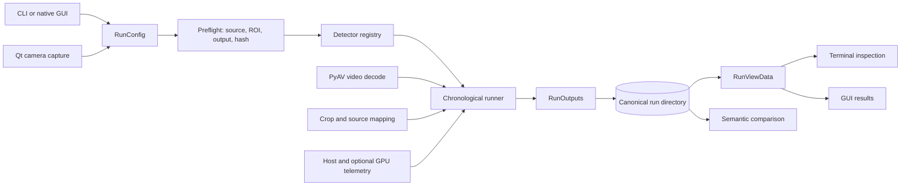

# Adaptive Edge Perception: Architecture Review

**Review date:** 2026-08-07
**Status:** current checkpoint reviewed; target architecture proposed, not implemented

This is the canonical architecture review for Adaptive Edge Perception. Statements labeled **Current** describe repository code or recorded evidence. Statements labeled **Target** are recommendations and must not be read as shipped behavior.

## 1. Executive verdict

**Verdict.** The repository is a credible offline detector-checkpoint runner with unusually careful artifact, cancellation, and test boundaries. It is not yet an adaptive-perception or reinforcement-learning system. The shortest honest path forward is to repair two artifact-integrity blockers, preserve the current runner as a compatibility path, and introduce one framework-neutral runtime that recorded replay, Gymnasium, and live transfer all share.

The detector-versus-tracker scheduling idea is **not novel by itself**. DorT schedules detection versus tracking, SmartTBD applies deep reinforcement learning to tracking-by-detection configuration, and Chanakya learns runtime choices for adaptive perception ([DorT primary publication](https://www.microsoft.com/en-us/research/publication/detect-or-track-towards-cost-effective-video-object-detection-tracking/), [SmartTBD DOI](https://doi.org/10.1145/3703912), [Chanakya paper](https://proceedings.neurips.cc/paper_files/paper/2023/file/ae2d574d2c309f3a45880e4460efd176-Paper-Conference.pdf)). The defensible open-source contribution is the **reproducible environment/runtime/evaluation boundary**: pinned inputs and components, explicit actions and budgets, deterministic replay, honest live capture, canonical artifacts, and comparable evaluation.

### Explain it to a ten-year-old

Imagine a robot watching a movie. Its sharp “detector eyes” are accurate but slow and expensive. Its “tracker memory” is cheaper, but it can drift. A strategy chooses which one to use on each frame. Recorded movies let us replay the same challenge fairly for every strategy. A live camera is the final exam: the robot must act on time, while we record everything and grade it later. Today, this project has the movie player, detector seam, stopwatch, and report folder. It does not yet have tracker memory, a choosing strategy, a Gymnasium classroom, or the live final exam.

## 2. What the current checkpoint proves—and does not

### Current proof

The published checkpoint runs a deterministic 200×100, 30 FPS, exactly three-frame video twice through production CLI/configuration, PyAV decode, chronological execution, artifact writing, inspection, and comparison. Only external detector loading is replaced by a deterministic fake. Each run records 3 processed frames, 9 inferences, and 3 annotated PNGs; comparison reports 9 detections per side and zero mismatches ([checkpoint report](checkpoints/eyes-and-stopwatch.md), [acceptance test](../tests/test_cli_workflow_acceptance.py)).

The branch’s non-model verification baseline is exactly `492 passed, 1 skipped, 1 deselected`. That is broad engineering-test evidence under the repository’s `not model` marker, **not** evidence of detector accuracy, tracking quality, policy quality, or generalization ([test configuration](../pyproject.toml), [test suite](../tests/)).

The binding architecture-review evidence packet also records a real CUDA reference run with **10 frames, 30 inferences, 259 detection records, 5 annotations, complete-frame p50 259.507 ms, and semantic CPU/GPU comparison with 259 detections on each side and zero mismatches**. These are checkpoint/reference observations, not a generalized performance result; the source tree does not bundle the private media, model weights, or raw run directories ([review plan](superpowers/plans/2026-08-07-architecture-review-artifact.md), [release policy and limitations](checkpoints/eyes-and-stopwatch.md)).

The current package provides:

- a detector-neutral protocol and one lazily loaded, revision-pinned D-FINE registration ([detector protocol](../src/edge_perception/detector.py), [registry](../src/edge_perception/detectors/registry.py), [adapter](../src/edge_perception/detectors/dfine.py));
- chronological full-frame-then-ROI execution with source-coordinate mapping and batch size one ([runner](../src/edge_perception/runner.py), [geometry](../src/edge_perception/geometry.py));
- manifest, summary, inference, detection, hardware, and optional PNG artifacts ([artifact writer](../src/edge_perception/outputs.py), [artifact tests](../tests/test_outputs.py));
- terminal inspection, semantic comparison, and a native PySide6 projection over shared run data ([inspection](../src/edge_perception/inspection.py), [comparison](../src/edge_perception/compare.py), [run projection](../src/edge_perception/run_view.py), [GUI results](../src/edge_perception/gui/results.py)); and
- optional Qt camera recording plus a native GUI whose run executes in an isolated worker process ([capture](../src/edge_perception/capture.py), [run controller](../src/edge_perception/gui/run_controller.py), [worker](../src/edge_perception/worker.py)).

### What it does not prove

The current package has no `Strategy`, tracker, action catalog, budget ledger, replay environment, reward oracle, learned policy, Gymnasium API, or live adaptive inference loop; its declared dependencies likewise contain no RL framework ([package modules](../src/edge_perception/), [project metadata](../pyproject.toml)). The checkpoint therefore does not prove:

- detector accuracy or dataset-level quality;
- tracker accuracy, detector/tracker scheduling value, or learned-policy value;
- train/test generalization or statistically supported improvement;
- throughput, deadlines, time-to-detection, dropped-frame behavior, or sustained live latency;
- CPU-versus-CUDA performance beyond the recorded reference observation; or
- native Linux GUI, GPU, or camera operation ([checkpoint limitations](checkpoints/eyes-and-stopwatch.md)).

## 3. Clean install and first run

Python 3.12 is required, and detector runtimes, weights, videos, and Qt are not bundled. The checkout defines mutually exclusive CPU and CUDA 12.8 extras and a separate GUI/camera extra ([project metadata](../pyproject.toml), [install guide](../README.md)). Install `uv` using its [official installation instructions](https://docs.astral.sh/uv/getting-started/installation/).

### Windows 11 native: reference path

Run in PowerShell from a fresh checkout. Choose one detector backend; do not combine `cpu` and `cu128`.

```powershell
git clone <REPOSITORY-URL> adaptive-edge-perception
Set-Location adaptive-edge-perception

# CPU plus native GUI and camera support
uv sync --extra cpu --extra gui

# Or, in a separate clean environment, CUDA 12.8 plus native GUI
# uv sync --extra cu128 --extra gui

uv run edge-perception --help
uv run edge-perception run videos/reference.mp4 `
  --output runs/reference-a `
  --detector dfine-nano-coco `
  --device cpu `
  --max-frames 3 `
  --warmup-runs 0 `
  --annotate-every 1
uv run edge-perception inspect runs/reference-a
```

`videos/reference.mp4` must be a local video the user may lawfully process. A real run also requires access to the registry’s pinned D-FINE files. Verify the imported backend before a measured run using the commands in the [repository install guide](../README.md).

### Ubuntu under WSL2: headless developer preview

Install WSL/Ubuntu from Windows, then place the checkout in the Linux filesystem—for example `~/src`—rather than `/mnt/c`. Microsoft explicitly recommends this placement for Linux-command-line filesystem performance ([Microsoft WSL filesystem guidance](https://learn.microsoft.com/en-us/windows/wsl/filesystems)).

```powershell
wsl.exe --install -d Ubuntu-24.04
wsl.exe --update
```

```bash
mkdir -p ~/src
cd ~/src
git clone <REPOSITORY-URL> adaptive-edge-perception
cd adaptive-edge-perception

# Install uv using the official Linux instructions first.
uv sync --extra cpu
uv run edge-perception --help
uv run edge-perception run videos/reference.mp4 \
  --output runs/reference-a \
  --detector dfine-nano-coco \
  --device cpu \
  --max-frames 3 \
  --warmup-runs 0 \
  --annotate-every 0
uv run edge-perception inspect runs/reference-a
```

For a CUDA smoke test, use `uv sync --extra cu128`, keep the NVIDIA driver on Windows, and do not install a Linux display driver inside WSL, following NVIDIA’s [CUDA on WSL guide](https://docs.nvidia.com/cuda/wsl-user-guide/index.html). This lane is headless: it makes no camera, GUI, or native-Linux support claim.

## 4. Current repository and system map

The CLI owns `run`, `inspect`, `compare`, `camera`, and `gui` command routing; direct runs invoke the same configuration, preflight, detector registry, and runner used by the worker path ([CLI](../src/edge_perception/cli.py), [configuration](../src/edge_perception/config.py), [worker](../src/edge_perception/worker.py)).



| Current boundary | Responsibility | Evidence |
| --- | --- | --- |
| `RunConfig` and capture records | Validate JSON-native run and capture configuration | [config.py](../src/edge_perception/config.py), [config tests](../tests/test_config.py) |
| Video boundary | Probe and yield chronological RGB frames through PyAV | [video.py](../src/edge_perception/video.py), [video tests](../tests/test_video.py) |
| Detector seam | Warm up, predict, report identity and optional peak device memory | [detector.py](../src/edge_perception/detector.py), [contract tests](../tests/test_contracts.py) |
| Runner | Execute full frame and declared ROIs synchronously, map results, finalize status | [runner.py](../src/edge_perception/runner.py), [runner tests](../tests/test_runner.py) |
| Artifact writer | Claim an empty directory and publish structured records and terminal summary | [outputs.py](../src/edge_perception/outputs.py), [output tests](../tests/test_outputs.py) |
| Readers | Project a run for humans or compare semantic schedules/detections | [run_view.py](../src/edge_perception/run_view.py), [compare.py](../src/edge_perception/compare.py) |
| Native adapters | Capture video, control the worker, and project canonical results | [capture.py](../src/edge_perception/capture.py), [main_window.py](../src/edge_perception/gui/main_window.py) |

## 5. Recorded replay and live transfer workflows

### Target: recorded replay, training, and evaluation

Recorded video is the deterministic research lane.

1. Prepare a lawful source once: copy or content-address the exact bytes, hash them, probe dimensions/timing, attach annotation provenance, and assign an immutable episode ID.
2. Precompute action-independent content features and expensive detector outcomes for every allowed detector action. Pin component revisions and parameters.
3. Reset the replay backend at a named episode and seed. It yields frames in source order, never wall-clock order.
4. At each frame, the strategy selects an action ID from the `ActionCatalog`; the runtime applies that action, advances tracker state, charges the `BudgetLedger`, and writes a canonical transition.
5. The `RewardOracle` scores predictions against replay-only ground truth. Training may consume reward; evaluation uses frozen policy/checkpoint/configuration and held-out episodes.
6. The evaluator aggregates quality, compute, violations, and uncertainty. The canonical reader must be able to reconstruct and validate every reported result.

### Target: live deployment and transfer

Live camera is the transfer lane, not the training oracle.

1. Acquire frames through a live backend with explicit queue capacity and stale-frame policy.
2. Run the same strategy and `PerceptionEngine` used in replay, under a real monotonic-time budget.
3. Record the source stream, frame arrival/capture times, actions, predictions, component timings, dropped/stale frames, and budget state.
4. Never fabricate online reward. During the live session, emit reward as unavailable and keep safety/health signals separate from scientific quality.
5. Materialize the session as a replayable artifact, add ground truth later, and score it offline with the same `RewardOracle` and evaluator.
6. Promote from shadow mode to action-driving mode only after replay parity, sustained live tests, and explicit safety review.

Qt supplies cross-platform camera and recording APIs, but its media documentation warns that formats, hardware acceleration, and behavior can differ by platform and recommends target-platform testing ([Qt Multimedia](https://doc.qt.io/qt-6/qtmultimedia-index.html), [Qt camera overview](https://doc.qt.io/qt-6/cameraoverview.html)).

## 6. Target system boundaries

Each boundary below starts with its plain-language job; the formal name follows.

| Plain-language job | Target interface | Contract |
| --- | --- | --- |
| Freeze what will be read, then provide frames without exposing a decoder implementation. | `PreparedSource` / `FrameSource` | `PreparedSource` owns content digest, metadata, provenance, and an `open()` factory. `FrameSource` yields immutable frame envelopes with episode/frame IDs and source time. Replay and live implementations obey different pacing but the same envelope. |
| Choose what perception work to do next. | `Strategy` | Pure decision boundary: observation plus deterministic strategy state in, stable action ID plus next strategy state out. It does not decode, call models, write artifacts, or compute reward. |
| Convert a detector implementation into neutral predictions and identity. | `DetectorAdapter` | Evolves the current `Detector` seam with explicit configuration identity and measured outcome; model weights remain external. |
| Carry object hypotheses cheaply between detector refreshes. | `Tracker` | Reset/update/predict with serializable state identity. Tracking state belongs to an episode, not a global singleton. |
| Apply one chosen action in a consistent order. | `PerceptionEngine` | Deterministic perception state machine over detector, tracker, and frame. It returns predictions, timings, and next state without framework-specific types. |
| Own a complete session and its operational resources. | `InspectionRuntime` | Coordinates `FrameSource`, `Strategy`, `PerceptionEngine`, `BudgetLedger`, cancellation, and canonical writing for replay or live backends. |
| Give every legal choice a stable number and full meaning. | `ActionCatalog` | Versioned finite catalog mapping `action_id` to detector/tracker/ROI/model parameters. Gymnasium exposes `Discrete(len(catalog))`; artifacts retain the catalog and selected IDs. |
| Count scarce resources and reject dishonest accounting. | `BudgetLedger` | Charges defined cost units—initially measured execution time and invocation counts—records reservations/actuals, and reports violations without hiding overruns. |
| Advance a pinned recording reproducibly. | Replay backend | Source-order stepping, reset/seed support, cached outcomes, ground-truth access only through the oracle, and no wall-clock pacing. |
| Consume arriving frames under deadlines. | Live backend | Monotonic timestamps, bounded queue, explicit drop/stale policy, no ground truth, and complete session recording. |
| Grade predictions when labels actually exist. | `RewardOracle` | Replay/offline-only quality and scalarization boundary. It never runs inside an unlabelled live session. Reward version and parameters are artifact identity. |
| Compare strategies without training leakage. | Evaluator | Runs frozen policies over held-out episode manifests, computes per-episode metrics and uncertainty, and emits machine-readable plus human-readable summaries. |
| Make results durable and refuse incomplete evidence. | Canonical artifact writer/reader | One versioned schema for sources, components, action catalog, transitions, predictions, timings, rewards/availability, terminal state, and checksums. The reader validates every required stream and cross-file count/join invariant. |

The runtime core must not import Gymnasium, SB3, RLlib, TorchRL, Qt, or a detector framework. Those packages are adapters around the core, which keeps replay, live operation, and evaluation behavior comparable.

## 7. Gymnasium research contract

### Public contract

**Target:** one single-agent Gymnasium environment wraps the recorded replay backend. Gymnasium’s current API returns `(observation, reward, terminated, truncated, info)` from `step` and `(observation, info)` from `reset`; separating termination from truncation is important for correct bootstrapping ([Gymnasium `Env` API](https://gymnasium.farama.org/api/env/), [time-limit guidance](https://gymnasium.farama.org/tutorials/gymnasium_basics/handling_time_limits/)).

The initial spaces should be deliberately small and fixed-shape:

```text
observation_space = Dict({
  "content": Box(float32, shape=(CONTENT_FEATURES,)),
  "tracks": Box(float32, shape=(MAX_TRACKS, TRACK_FEATURES)),
  "track_mask": MultiBinary(MAX_TRACKS),
  "system": Box(float32, shape=(SYSTEM_FEATURES,)),
  "last_action": Discrete(ACTION_COUNT),
})

action_space = Discrete(ACTION_COUNT)
```

`content` must be action-independent for the current frame. `tracks` and `track_mask` summarize bounded tracker state. `system` contains normalized budget remaining, age since last detection, and prior measured costs. The exact feature definitions, normalization constants, `MAX_TRACKS`, and ordering are versioned environment configuration, not hidden conventions.

`info` is diagnostic evidence, not a second observation channel. It should include `episode_id`, `frame_index`, `source_time_ms`, `action_id`, `action_spec`, actual cost, budget remaining, prediction reference, component revisions, cache key, reward components/availability, violation flags, and terminal reason. A policy must not require `info` to act.

### Episode endings

- `terminated=True`: the recorded source reaches its natural end, or a task-defined terminal condition that is part of the MDP occurs.
- `truncated=True`: an external evaluation horizon or operational cap stops an otherwise valid episode.
- Budget exhaustion is termination only if the budget is explicitly part of the task definition; an evaluator-imposed cap is truncation.
- Corrupt artifacts, impossible action IDs, cache misses, and component failures raise controlled errors. They are not successful terminal transitions.

### Training/evaluation separation

Split by source or scene group—not adjacent frames—before feature generation or policy tuning. Training may explore and update parameters. Validation selects hyperparameters. Test evaluation loads a frozen policy, reward definition, action catalog, detector/tracker revisions, and episode manifest; it performs no learning and does not reuse test labels for decisions.

### Counterfactual cache is required

Without a cache, one policy may appear cheaper or better because it caused different model work to run, warmed a different path, or observed a transient runtime condition. Before policy comparison, cache every expensive action-independent detector result for each allowed frame/action configuration. Tracker transitions remain deterministic from pinned state plus cached detector results; any stochastic component carries an explicit seed. Cache identity includes source digest, frame, action specification, component revisions, parameters, and relevant state digest. A miss invalidates that transition rather than silently running a new model inside evaluation.

### Framework comparison

Gymnasium is the sole proposed public environment contract. Other frameworks are consumers or future adapters.

| Framework | Fit | Decision |
| --- | --- | --- |
| [Gymnasium](https://gymnasium.farama.org/) | Small, standard single-agent environment API and spaces | **Core public contract** |
| [Stable-Baselines3](https://stable-baselines3.readthedocs.io/en/master/guide/custom_env.html) | Fastest route to familiar baseline algorithms and an environment checker; supports a subset of Gymnasium features | First training adapter, not a dependency of the runtime |
| [RLlib](https://docs.ray.io/en/latest/rllib/rllib-env.html) | Distributed sampling/training and multi-agent facilities, with greater operational weight | Compatibility smoke test after the core is stable |
| [TorchRL](https://docs.pytorch.org/rl/stable/reference/generated/torchrl.envs.EnvBase.html) | TensorDict-native specs, transforms, collectors, and batched environments | Future adapter; do not make TensorDict a core type |
| [Minari](https://minari.farama.org/main/content/basic_usage/) | Standard hosting/collection/sampling interface for offline RL datasets | Future export/import format, not the canonical artifact |
| [EnvPool](https://envpool.readthedocs.io/en/latest/content/python_interface.html) | High-throughput batched Gymnasium-compatible stepping | Defer until profiling shows environment stepping is the bottleneck |
| [PettingZoo](https://pettingzoo.farama.org/api/parallel/) | Standard multi-agent APIs, including simultaneous-action environments | Defer unless independently acting cameras/devices create genuine agents |

Conventions deliberately deferred until experiments justify them: reward weights, exact content/track features, recurrent-policy state format, action masking versus controlled rejection, vector-environment/autoreset semantics, Minari schema mapping, distributed sampling, rendering conventions, and all multi-agent APIs.

## 8. Scientific proof and benchmark plan

### Questions and preregistered comparisons

The primary question is whether an adaptive strategy improves the quality-versus-compute frontier on held-out sources—not whether one cherry-picked run is faster. Register the source split, action catalog, reward components, budget levels, baselines, seeds, and exclusion rules before final test evaluation.

Required baselines:

1. detect every frame;
2. detect every fixed `N` frames and track between detections, across several `N` values;
3. detect once then tracker-only;
4. confidence/drift heuristic under the same action catalog;
5. random actions matched to the learned policy’s compute budget;
6. learned strategy; and
7. a non-deployable oracle or per-frame upper bound, clearly labeled as such.

### Data splits and quality

Create train, validation, and held-out test groups by complete video, camera, scene, or collection session. Near-duplicate scenes and frames from one recording must not cross groups. Report the dataset/license/provenance manifest and class/event support per split.

For detection, report the annotation-appropriate precision/recall and average-precision metrics. For tracking, add an accepted tracking metric only when track IDs and tracker semantics exist. Always report quality against compute as curves or Pareto fronts across budgets, not only one scalar reward.

### Runtime and live protocol

For each policy, report end-to-end frame latency and component latency distributions (`p50`, `p95`, `p99`, maximum, and sample count), detector/tracker invocation counts, wall time, and memory where available. Keep warm-up policy, hardware, power mode, dependency versions, and action catalog fixed and recorded.

The live time-to-detection protocol must define an object-entry event from offline labels, then measure from the first captured frame containing the object to the first qualifying prediction available before its deadline. Report misses separately rather than assigning a convenient finite latency. Also report captured, processed, dropped, and stale frame counts; queue residence; deadline misses; and every budget violation.

### Uncertainty and reproducibility

Use multiple policy-training seeds and evaluate every frozen seed on the same held-out episode manifest. Report per-seed results, mean/median, dispersion, and confidence intervals that resample at the video/session level rather than treating correlated frames as independent. Deterministic baselines still receive episode-level uncertainty. Publish enough canonical artifacts to reconstruct every aggregate and explain all exclusions.

Progression of proof:

1. contract tests with fake detector/tracker and tiny generated video;
2. deterministic replay equivalence and cache-identity tests;
3. held-out recorded-video baseline benchmark;
4. shadow-mode live capture with offline grading;
5. sustained live transfer under declared hardware/budgets; and
6. independently reproducible release benchmark.

## 9. Platform support

| Platform | Support position | What is allowed to be claimed | Promotion evidence |
| --- | --- | --- | --- |
| Windows 11 native | **Tier-1/reference live-device path** | Current checkpoint and optional camera/CUDA observations on the reference system ([checkpoint](checkpoints/eyes-and-stopwatch.md)) | Keep clean install, full non-model tests, GUI, camera, CPU/CUDA smoke, cancellation, and sustained live protocol green on reference hardware |
| Ubuntu under WSL2 | **Developer-preview Linux user-space/headless/CUDA-smoke path with no camera or native-Linux claim** | Headless dependency, test, replay, and optional CUDA-smoke work only | Reproducible WSL clean install/tests and CUDA smoke using NVIDIA’s supported WSL path ([NVIDIA guide](https://docs.nvidia.com/cuda/wsl-user-guide/index.html)); remain explicit that this is not native Linux |
| Ubuntu 24.04 native | **CI portability target until physical GUI/GPU/camera validation exists** | Static/CI portability only; no live-device support claim | Native clean install; full tests; package build; PyAV decode; Qt GUI on a real display; camera discovery, strict/non-strict capture and cleanup; CPU and NVIDIA CUDA runs; media-backend matrix; cancellation; and sustained live benchmark on physical Ubuntu hardware |
| macOS | **Unvalidated / out of scope** | No support claim | Separate owner, hardware matrix, packaging, GUI/media/camera, CPU/accelerator, and live evidence |

Qt lists desktop platforms but also documents platform-specific multimedia differences; library availability is not product validation ([Qt supported platforms](https://doc.qt.io/qt-6/supported-platforms.html), [Qt Multimedia backend notes](https://doc.qt.io/qt-6/qtmultimedia-index.html)).

## 10. Architecture review

### Strengths to preserve

- **Neutral model seam.** The protocol keeps framework types out of the runner, while lazy registry loading keeps base CLI surfaces light ([detector.py](../src/edge_perception/detector.py), [registry.py](../src/edge_perception/detectors/registry.py)).
- **Auditable chronological execution.** Full-frame and declared ROI order, source-coordinate mapping, timing definitions, and durable per-frame publication are explicit ([runner.py](../src/edge_perception/runner.py), [outputs.py](../src/edge_perception/outputs.py)).
- **Shared product boundary.** CLI, worker, terminal inspection, and GUI results converge on the same configuration/run artifacts rather than separate hidden pipelines ([cli.py](../src/edge_perception/cli.py), [worker.py](../src/edge_perception/worker.py), [run_view.py](../src/edge_perception/run_view.py)).
- **Honest checkpointing.** The repository separates generated fake-detector acceptance from optional camera/model evidence and names unsupported conclusions ([checkpoint report](checkpoints/eyes-and-stopwatch.md)).

### P0 blockers

1. **Ordinary file inputs are not pinned to the exact bytes later inferred.** Preflight hashes `config.input_path`, but ordinary files are reopened for preview and measured decode. Only capture-provenance inputs are copied to a snapshot and rehashed, leaving a time-of-check/time-of-use gap for ordinary files ([preflight.py](../src/edge_perception/preflight.py), [runner.py](../src/edge_perception/runner.py), [capture snapshot tests](../tests/test_runner.py)). **Required fix:** prepare every source into an immutable or verified snapshot before output claim; the manifest digest must identify the exact bytes decoded.
2. **The shared completed-run reader can accept missing primary data streams.** `load_run_view` reads manifest, summary, and annotations but does not require or cross-check `inferences.jsonl`, `detections.jsonl`, or `hardware.jsonl`; a directory can therefore appear completed to inspection/GUI while primary evidence is absent ([run_view.py](../src/edge_perception/run_view.py), [reader tests](../tests/test_results.py)). **Required fix:** one canonical reader validates required files, schema/run IDs, line records, joins, counts, terminal invariants, and checksums before any consumer calls a run complete.

No policy-quality benchmark or artifact release should proceed while either P0 remains.

### P1 risks

- **Two reader standards.** Semantic comparison validates primary streams independently while inspection uses a lighter projection, allowing consumers to disagree about validity ([compare.py](../src/edge_perception/compare.py), [run_view.py](../src/edge_perception/run_view.py)).
- **Absolute-path provenance.** Current manifests preserve resolved source/output paths, which aid local diagnosis but are not sufficient portable identity; digests and logical source IDs must be authoritative ([runner.py](../src/edge_perception/runner.py)).
- **No executable action/budget semantics.** Adding policy code directly to the current frame loop would couple science to implementation order and make fair counterfactual evaluation difficult ([runner.py](../src/edge_perception/runner.py)).
- **No live backpressure contract.** Camera acquisition produces a finalized video for the offline runner; it does not define live queues, stale frames, dropped frames, or deadlines ([capture.py](../src/edge_perception/capture.py), [runner.py](../src/edge_perception/runner.py)).
- **Evidence concentration.** Windows is the only exercised platform, and the published real-model lane is a bounded smoke check rather than a benchmark ([checkpoint report](checkpoints/eyes-and-stopwatch.md)).

### P2 / deferred work

Vectorized environments, distributed RL, Minari export, multi-agent cameras, plugin discovery, remote execution, richer GUI experiment management, and deployment packaging are useful only after the single-process contract and benchmark are credible.

### Current versus target

| Concern | Current | Target |
| --- | --- | --- |
| Input | Local video path, preflight hash; capture-only snapshot | Every source immutable/prepared and content-addressed |
| Decision | Fixed full-frame then every configured ROI | `Strategy` selects a versioned `ActionCatalog` entry |
| Perception | Detector only | Neutral detector plus tracker behind `PerceptionEngine` |
| Compute | Measured timings and telemetry | Enforced/recorded `BudgetLedger` with violations |
| Research API | CLI/library checkpoint call | Replay-backed single-agent Gymnasium environment |
| Reward | None | Replay/offline-only versioned `RewardOracle` |
| Live | Record camera, then run offline | Bounded live backend using the same runtime; record now, grade later |
| Evidence reader | Separate projection and comparison readers | One strict canonical reader feeding all consumers |

## 11. Roadmap

### NOW — make current evidence trustworthy

- Repair both P0s with adversarial regression tests.
- Define one strict canonical artifact reader and explicit schema compatibility policy.
- Preserve the current CLI runner and checkpoint proof while documenting source identity precisely.

### NEXT — introduce the framework-neutral runtime

- Add `PreparedSource`/`FrameSource`, `ActionCatalog`, `BudgetLedger`, `Strategy`, `Tracker`, `DetectorAdapter`, `PerceptionEngine`, and `InspectionRuntime` with fake components first.
- Re-express the existing fixed full-frame/ROI schedule as a baseline `Strategy` and prove output compatibility.
- Define replay/live backend protocols and canonical transition artifacts without adding an RL framework dependency.

### THEN — establish the research environment

- Add the replay backend, required counterfactual cache, `RewardOracle`, evaluator, and single-agent Gymnasium adapter.
- Run Gymnasium and SB3 environment checkers, implement required baselines, freeze held-out splits, and publish quality-versus-compute results with uncertainty.
- Add live shadow mode that records source/actions/predictions/timings for offline scoring; validate time-to-detection and drop/stale semantics.

### LATER — scale only after evidence

- Consider TorchRL, RLlib, Minari, and EnvPool adapters based on measured need.
- Promote native Ubuntu only after the physical evidence matrix passes.
- Consider PettingZoo only if independently acting devices create a real multi-agent problem.

## 12. Review questions and decision log

### Questions that must be answered before implementation

1. What is the smallest v0 action catalog: detect/track only, or detector model/ROI choices too?
2. Is a step always one source frame, and how is a missing or late live frame represented?
3. Which quality metric and annotation format define the first `RewardOracle`?
4. Which tracker is the reference implementation, and can its complete state be serialized and deterministically replayed?
5. Are budget units measured milliseconds, normalized device cost, invocation counts, or a vector of all three?
6. Which videos form immutable train/validation/test groups, and what licenses permit redistribution of metadata or media?
7. Which live queue policy is canonical: process-all, newest-only, or deadline-aware?
8. Which artifact fields are required for failed/cancelled sessions versus completed research episodes?

### Decision log

| ID | Decision | Rationale |
| --- | --- | --- |
| D-001 | Markdown is the canonical architecture source. | Keeps claims reviewable, diffable, and linkable. |
| D-002 | Recorded video is the replay/training/evaluation lane; live camera is deployment/transfer. | Replay supplies repeatability and labels; live supplies deadlines and distribution shift. |
| D-003 | Gymnasium is the only proposed public environment contract. | Avoids framework leakage while retaining broad compatibility. |
| D-004 | The scheduling problem is single-agent. | Detector, tracker, and strategy are components; use multi-agent APIs only for independently acting devices. |
| D-005 | Live sessions never fabricate online reward. | Quality requires ground truth; live evidence is recorded and scored offline. |
| D-006 | Detector implementations and weights remain external. | Preserves neutrality and avoids redistribution/licensing claims. |
| D-007 | Windows 11 native is Tier 1; WSL2 is headless developer preview; Ubuntu 24.04 native is a CI target. | Matches evidence rather than theoretical framework support. |
| D-008 | Novelty is claimed for the reproducible boundary, not detector/tracker scheduling itself. | Prior work already studies adaptive detect/track scheduling. |
| D-009 | Source-byte pinning and strict completed-run validation are release-blocking P0s. | Scientific conclusions require exact inputs and complete primary evidence. |

## 13. Primary sources and references

### Repository evidence

- [README and current workflows](../README.md)
- [Eyes and Stopwatch checkpoint](checkpoints/eyes-and-stopwatch.md)
- [Architecture-review implementation plan and binding evidence](superpowers/plans/2026-08-07-architecture-review-artifact.md)
- [CLI workflow acceptance test](../tests/test_cli_workflow_acceptance.py)
- [Current source package](../src/edge_perception/)
- [Current test suite](../tests/)

### Environment and RL frameworks

- [Gymnasium `Env` API](https://gymnasium.farama.org/api/env/) and [custom-environment guide](https://gymnasium.farama.org/introduction/create_custom_env/)
- [Stable-Baselines3 custom environments](https://stable-baselines3.readthedocs.io/en/master/guide/custom_env.html)
- [RLlib environments](https://docs.ray.io/en/latest/rllib/rllib-env.html)
- [TorchRL `EnvBase`](https://docs.pytorch.org/rl/stable/reference/generated/torchrl.envs.EnvBase.html)
- [Minari basic usage and offline-dataset role](https://minari.farama.org/main/content/basic_usage/)
- [EnvPool Python interface](https://envpool.readthedocs.io/en/latest/content/python_interface.html)
- [PettingZoo Parallel API](https://pettingzoo.farama.org/api/parallel/)

### Platforms and media

- [Microsoft: working across Windows and Linux filesystems](https://learn.microsoft.com/en-us/windows/wsl/filesystems)
- [NVIDIA: CUDA on WSL user guide](https://docs.nvidia.com/cuda/wsl-user-guide/index.html)
- [Qt supported platforms](https://doc.qt.io/qt-6/supported-platforms.html)
- [Qt Multimedia](https://doc.qt.io/qt-6/qtmultimedia-index.html) and [camera overview](https://doc.qt.io/qt-6/cameraoverview.html)
- [uv installation](https://docs.astral.sh/uv/getting-started/installation/)

### Overlapping research

- Luo et al., [Detect or Track: Towards Cost-Effective Video Object Detection/Tracking (DorT)](https://www.microsoft.com/en-us/research/publication/detect-or-track-towards-cost-effective-video-object-detection-tracking/), AAAI 2019.
- Zhou et al., [SmartTBD: Smart Tracking for Resource-constrained Object Detection](https://doi.org/10.1145/3703912), ACM TECS 2025.
- [Chanakya: Learning Runtime Decisions for Adaptive Real-Time Perception](https://proceedings.neurips.cc/paper_files/paper/2023/file/ae2d574d2c309f3a45880e4460efd176-Paper-Conference.pdf), NeurIPS 2023.
